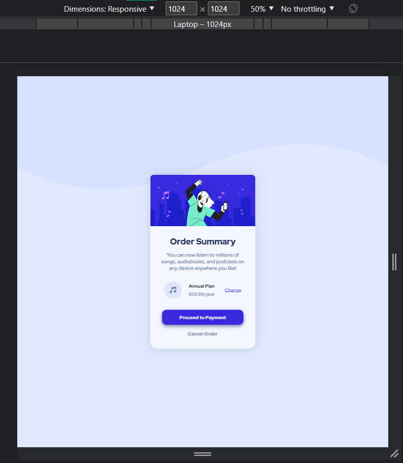
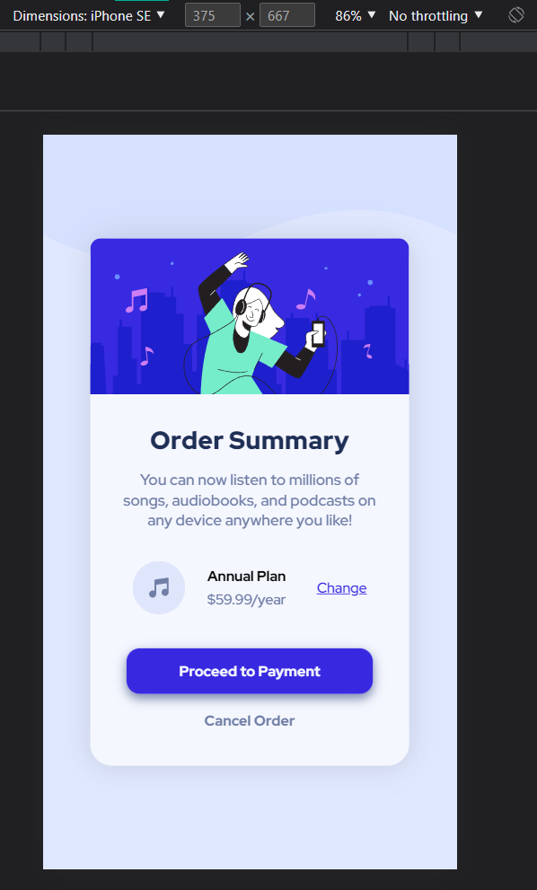

# Frontend Mentor - Order summary card

This is a solution to the [Order summary card challenge on Frontend Mentor](https://www.frontendmentor.io/challenges/order-summary-component-QlPmajDUj).

Frontend Mentor challenges helps improve skills by building realistic projects.

## Table of contents:

- [Overview](#overview)
  - [The challenge](#the-challenge)
  - [Screenshot](#screenshots)
  - [Links](#links)
- [My process](#my-process)
  - [Built with](#built-with)
  - [What I learned](#what-i-learned)
  - [Continued development](#continued-development)
- [Author](#author)
- [Acknowledgments](#acknowledgments)
- [Feedback & Suggestions](#feedback-&-Suggestions)
- [Notes](#notes)

## Overview:

### The challenge:

Users should be able to:

- View the optimal layout depending on their device's screen size
- See hover states for interactive elements
- Get it looking as close to the design as possible.

<br>

Preview of initial design:


### Screenshots:

<div align="center">

| Fullscreen View (Desktop)                             |
| ----------------------------------------------------- |
|  |

| Animated Preview (Not sure if this is 100% accurate due to height limit of screen) |
| ---------------------------------------------------------------------------------- |
|                                         |

<br>

**Note: This is a Mobile-First Approach & Wait for the GIF to load **

<br>

All viewports were included (except for the 4k view), in case the observer wishes to see the minor changes.

<br>

| Desktop View (1440px)                                | Laptop View (1024px)                                | Tablet View (768px)                                    |
| ---------------------------------------------------- | --------------------------------------------------- | ------------------------------------------------------ |
|  |  |  |

| Mobile L (425px)                                     | Mobile M (iPhone SE) (375px)                          | Mobile Small (320px)                                 |
| ---------------------------------------------------- | ----------------------------------------------------- | ---------------------------------------------------- |
|  |  |  |

</div>

### Links:

- Live Site URL: [Website Link - Click Me](https://order-summary-component-seven-alpha.vercel.app/)
- Solution URL: [FrontEndMentor - Click Me](https://www.frontendmentor.io/solutions/order-summary-card-solution-mobilefirst-w-css-flexbox-VqnTPAKNOw)

## My process:

### Built with:

- HTML5
- CSS3
- Mobile-First Approach

### What I learned:

Recap over some of the major learnings while working through this project:

#### General things I've learned:

- Basic review of HTML & CSS
- CSS Flex Layout (I'm comfortable utilzing it)
  - Finished it much faster than older projects using flex + few adjustment in spacing
- Make more use of css variables to make the code more readable & clean
- Make use of dynamic class that has same style to avoid redundancy

#### New things I've found/learned better:

- Reconsider using pixels (px) in size that doesn't need much adjustment.
- Avoid overusing of vh & vw, as it can cause problems in other devices.

<br>

This code snippets/function, is what **I'm proud to figure out**:

```css
.d-flex{
  display: flex;
  justify-content: center;
  align-items: center;
  flex-direction: column;
}

/***** Main Container*****/
main.ctn-main, 
.card-img{
  max-width: 290px; 
}

main.ctn-main{
  height: fit-content;
  padding-bottom: 2rem;
}

```

### Continued development:

<hr>

#### Here are a few possible areas that could be added or improved in the HTML and CSS code provided:

1. **Accessibility:** - It could be more accessible to users with disabilities.
2. **Responsiveness:** - Using responsive design techniques and media queries for different screen sizes and devices.
3. **Browser Compatibility:** - Not all browsers support the same features and rendering of web pages from the CSS styles I used.
4. **Cleaner Maintainable Code** - I'm not quite sure about this one, but I'm sure there is a much better/cleaner approach to do what I did.

## Author:

- Github - [@Iron-Mark](https://github.com/Iron-Mark)
- Frontend Mentor - [@Iron-Mark](https://www.frontendmentor.io/profile/Iron-Mark)

## Acknowledgments:

- I would like to acknowledge the hard work and dedication I put into creating this website.
- I am grateful for my friends and those who motivate me to push through and not settle for relaxation.
- I hope that this website serves its intended purpose. Thank you!


## Feedback & Suggestions:
### Community Feedback:

- **Vanza Setia** • 24,595 [_(@vanzasetia)_](https://github.com/vanzasetia)

  - For the card `(main.ctn-main)`, I don't see any issue. 
    - You have set a `max-width` to it to prevent it from getting too large. 
    - But, you don't need to set `height: fit-content` since it does not give any effect.

  - For the HTML markup:
    - There is no need to wrap the `<a>` tags and the `image` with `<div>` elements. 
    - Keep the HTML markup as **simple as possible**.

  - Also, I recommend using `<div>` instead of `<section>` tags: 
    - You should not overuse `<section>` or `<article>` elements
    - Since they can create unnecessary noises to screen reader users. 
    - Also, they don't have meaning. 
      - They only have meanings when they are labeled — [ WebAIM: HTML Semantics and Accessibility Cheat Sheet.](https://webaim.org/resources/htmlcheatsheet/)

<br>

### Next Action (Soon):
- [ ] Implement changes from community feedback
- [ ] Add some Javascript Functionalities
- [ ] Create my own modified version of this project.
- [ ] TBA...

## Notes:

- I would be happy to receive comments, criticism, and such that could improve the website:
  - Cleaner Code
  - Better Practice/Approach to making this website.
- Feel free to approach and contact me :>
<<<<<<< HEAD
  - _Feb, 14 2023 (Wireframing & Initial Plan) + (Initial Coding)_
  - _Feb, 17 2023 **Stopped for few days** (Continue Coding + Finalize Styles)_
  - _Feb, 18 2023 (Documentation)_
  - _Updated Feb 24, 2023_
=======
  - _Feb, 14 2023 Wireframing & Initial Plan) + (Initial Coding)_
  - _Feb, 17 2023 *Stopped for few days** (Continue Coding + Finalize Styles)_
  - _Feb, 18 2023 Documentation)_
>>>>>>> 8cbd6ae58df975594403c1bb70ec04518fd3b123
